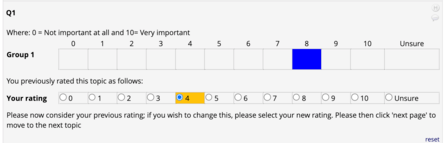
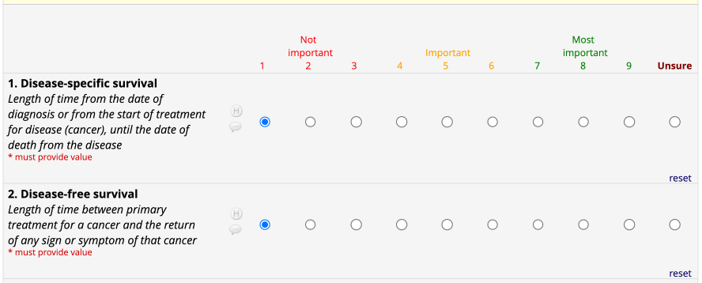
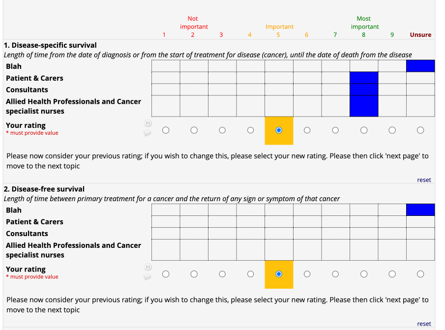
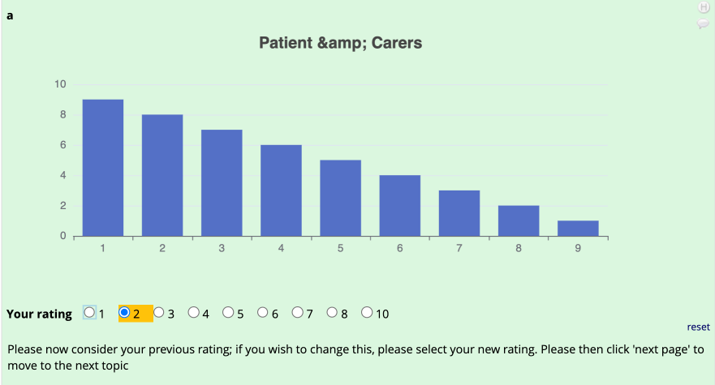

# REDCap Delphi

This module facilitates Delphi surveys in REDCap by adding a mechanism to display the results of a previous round
by stakeholder group and pre-populates a radio button group with the participants answer from a previous round.



## Display Types
The module supports the following display types:

### Default or display for a single question configured as radio buttons


### For use with forms setup using matrix questions.
| Round 1 Display | Round 2 Display |
| --------------- | --------------- |
|  |  |

### To display a chart


## ToDo
- Change the display to show a distribution of all answers for this question.
- Auto calculate the values to display

# Setup
Install the module from REDCap module repository and enable over Control Center.

# Configuration
## Default Display

- The Round 1 Delphi survey must use radio buttons to collect the answer.
- You should extract the data and calculate the mean value for each stakeholder group that you wish to display
- The Delphi survey that you wish to use this module on, must also ask the questions using radio buttons.
- For each question in the Delphi survey use the following annotation:

To use the default display you should use the following tag configuration.
```
@DELPHI={
    "type": "single",
    "preRound":"[round_1_arm_1][dss]", 
    "groups":[
            {"name":"Blah","score":"9","colour":"#0000FF"},
            {"name":"Patient & Carers","score":"7","colour":"#0000FF"},
            {"name":"Consultants","score":"7","colour":"#0000FF"},
            {"name":"Allied Health Professionals and Cancer specialist nurses","score":"7","colour":"#0000FF"}
        ]
    }
```

where:

| key | description                                                                                                                                                             | Example |
| --- |-------------------------------------------------------------------------------------------------------------------------------------------------------------------------| ------- |
| type | single for the default display or single-matrix if you wish to display for matrix questions. |
| preRound | The field in the previous round holding the participants score to this question in the format [event][field]                                                            | [event_1_arm_1][delphi01_q02] |
| groups | An array of the stakeholder groups, score to be assigned and colour to display the score in.                                                                            | [{"name":"Group 1","score":"9","colour":"#0000FF"},{"name":"Group 2","score":"8","colour":"#0000FF"}] |
| name | The name of the stakeholder group, used as a label in the table of previous scores.                                                                                     | Group 1 |
| score | The average score to display (this should be in the same range as that used for the radiobutton list), it also must equate to one of the keys in the radio button list. | 8 |
| colour | The colour to fill the table cell in with, as a HEX code                                                                                                                | #0000FF |

## Matrix display

- The Round 1 Delphi survey must use radio buttons to collect the answer.
- You should extract the data and calculate the mean value for each stakeholder group that you wish to display
- The Delphi survey that you wish to use this module on, must also ask the questions using radio buttons.
- For each question in the Delphi survey use the following annotation:

To use the default display you should use the following tag configuration.
```
@DELPHI={
    "type": "single-matrix",
    "preRound":"[round_1_arm_1][dss]", 
    "groups":[
            {"name":"Blah","score":"9","colour":"#0000FF"},
            {"name":"Patient & Carers","score":"7","colour":"#0000FF"},
            {"name":"Consultants","score":"7","colour":"#0000FF"},
            {"name":"Allied Health Professionals and Cancer specialist nurses","score":"7","colour":"#0000FF"}
        ]
    }
```

where:

| key | description                                                                                                                                                             | Example |
| --- |-------------------------------------------------------------------------------------------------------------------------------------------------------------------------| ------- |
| type | single for the default display or single-matrix if you wish to display for matrix questions. |
| preRound | The field in the previous round holding the participants score to this question in the format [event][field]                                                            | [event_1_arm_1][delphi01_q02] |
| groups | An array of the stakeholder groups, score to be assigned and colour to display the score in.                                                                            | [{"name":"Group 1","score":"9","colour":"#0000FF"},{"name":"Group 2","score":"8","colour":"#0000FF"}] |
| name | The name of the stakeholder group, used as a label in the table of previous scores.                                                                                     | Group 1 |
| score | The average score to display (this should be in the same range as that used for the radiobutton list), it also must equate to one of the keys in the radio button list. | 8 |
| colour | The colour to fill the table cell in with, as a HEX code                                                                                                                | #0000FF |

## Matrix display

- The Round 1 Delphi survey must use radio buttons to collect the answer.
- You should extract the data and calculate the mean value for each stakeholder group that you wish to display
- The Delphi survey that you wish to use this module on, must also ask the questions using radio buttons.
- For each question in the Delphi survey use the following annotation:

To use the default display you should use the following tag configuration.
```
@DELPHI={
    "type": "bar",
    "preRound":"[round_1_arm_1][dss]", 
    "groups":[
            {"name":"Blah","score":"9,8,7,6,5,4,3,2,1","colour":"#0000FF"}
        ]
    }
```

where:

| key | description                                                                                                                                         | Example |
| --- |-----------------------------------------------------------------------------------------------------------------------------------------------------| ------- |
| type | single for the default display or single-matrix if you wish to display for matrix questions.                                                        |
| preRound | The field in the previous round holding the participants score to this question in the format [event][field]                                        | [event_1_arm_1][delphi01_q02] |
| groups | An array of the stakeholder groups, score to be assigned and colour to display the score in.                                                        | [{"name":"Group 1","score":"9","colour":"#0000FF"},{"name":"Group 2","score":"8","colour":"#0000FF"}] |
| name | The name of the stakeholder group, used as a label in the table of previous scores.                                                                 | Group 1 |
| score | A comma seperated list of values to display, the order in which they are displayed will correspond to the order of the values of your radio buttons | 8 |
| colour | The colour to fill the table cell in with, as a HEX code                                                                                            | #0000FF |


# Changelog

| Version | Date        | Description |
| ------- |-------------| ----------- |
| 1.2 | 03 Mar 2025 | Added a bar chart |
|1.1 | 24 Feb 2025 | Added matrix display |
| 1.0 | 16 Jan 2025 | Intial release |